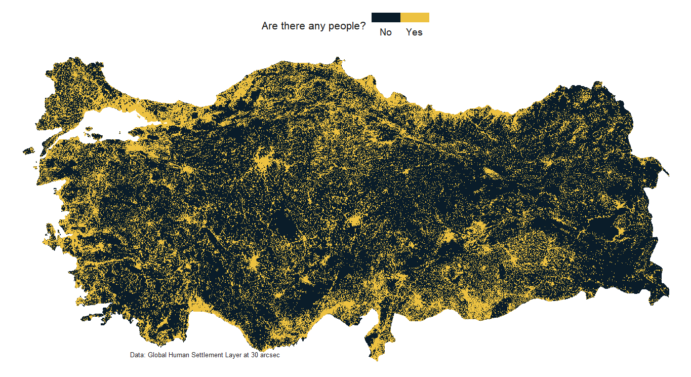

# Uninhabited Areas Analysis in Türkiye

## Overview
This project aims to analyze uninhabited areas in a country using the Global Human Settlement Layer (GHSL) data. The analysis involves downloading population data, cropping it to Türkiye's borders, and visualizing the results with a raster map.

## Requirements
Make sure to install the following R packages:

- `tidyverse`
- `terra`
- `giscoR`
- `httr`

## How to Use
  
  **Download GHSL Data:** 
The code downloads the GHSL population data for 2025. Adjust the URL if you want to download a different dataset.

  **Load and Process Data:** The data is unzipped and converted into a raster format.
The borders of Türkiye are fetched using the giscoR package.
  **Crop Data to Türkiye:** The population raster is cropped to the borders of Türkiye.

  **Create a Data Frame:** A data frame is created from the raster data, categorizing areas as inhabited or uninhabited.

  **Visualize the Results:** The results are visualized using ggplot2, creating a raster map showing inhabited areas in Türkiye.

### To display the map, make sure to include the following line at the end of your script:
`print(p)`

